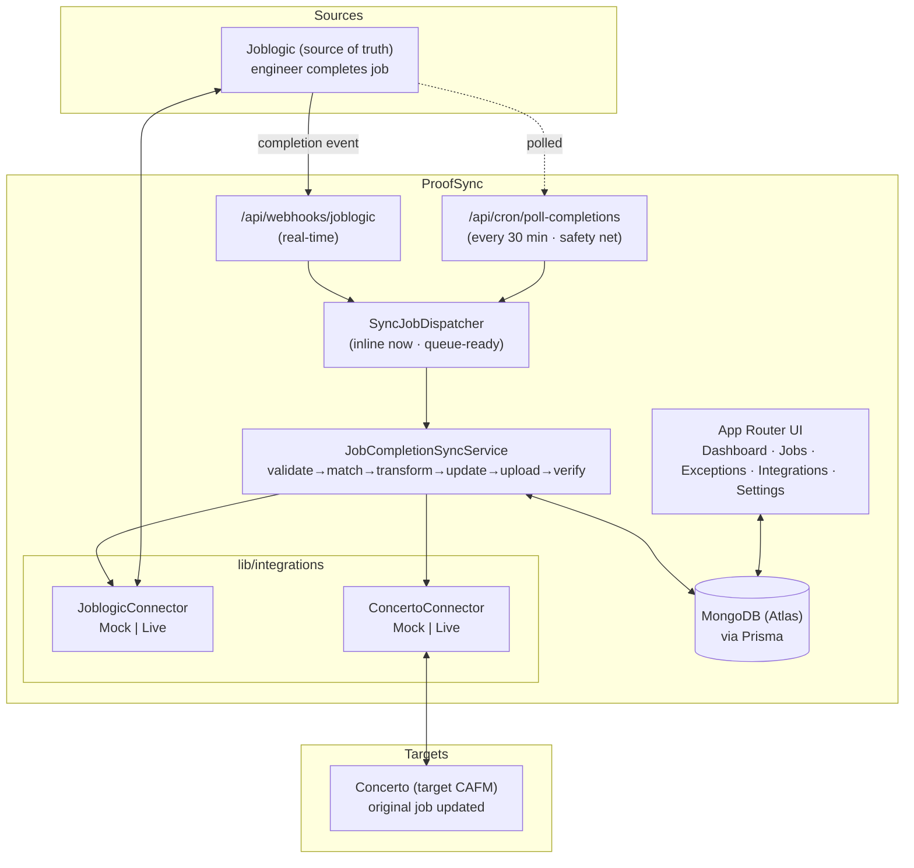
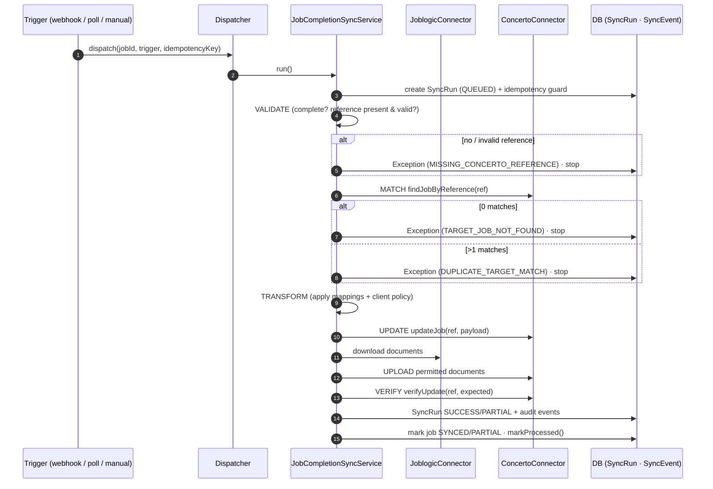
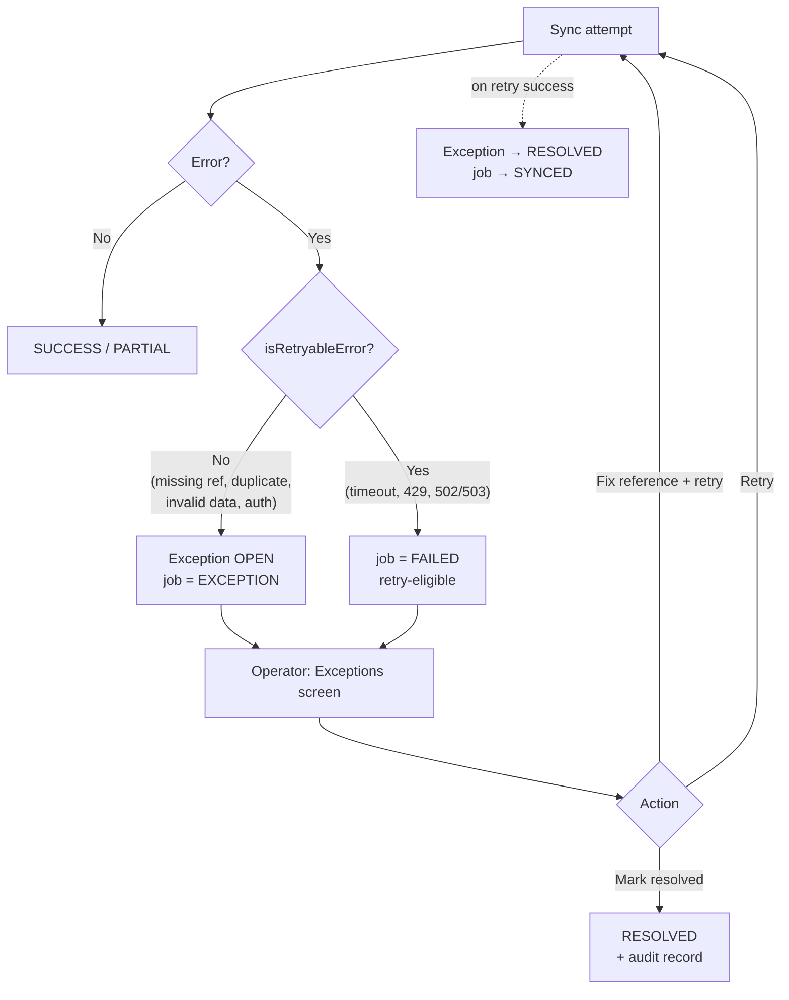

# Architecture

ProofSync is a Next.js (App Router) application with a clean separation between
**presentation** (server/client components), **application services**, a
**deterministic sync engine**, and **provider connectors**. Provider-specific logic
is confined to `lib/integrations/`; nothing above that layer knows how Joblogic or
Concerto format their requests.

## 1. System architecture

Mock mode short-circuits the connectors to the application database (the `Job` /
`JobCompletion` / `Document` tables stand in for Joblogic; the `MockConcertoJob`
table *is* the Concerto target), so the entire flow runs with no external services.

## 2. Sync sequence (JOBLOGIC → CONCERTO)

## 3. Exception flow

## Data model (Prisma)

`Organisation → Client → Job → { JobCompletion, Document, SyncRun → SyncEvent,
Exception }`, plus `IntegrationConnection`, `FieldMapping`, `ProcessedEvent`
(idempotency ledger) and `MockConcertoJob` (the demo target system). See
[`prisma/schema.prisma`](../prisma/schema.prisma).

## Key modules

| Concern | Location |
| --- | --- |
| Connector interfaces | `lib/integrations/types.ts` |
| Mock / live connectors | `lib/integrations/{joblogic,concerto}/` |
| Sync engine | `lib/sync/job-completion-sync-service.ts` |
| Field transforms | `lib/sync/field-transformer.ts` |
| Mapping + policy resolution | `lib/sync/mapping-resolver.ts` |
| Idempotency | `lib/sync/idempotency.ts` |
| Dispatcher abstraction | `lib/sync/dispatcher.ts` |
| Retry policy | `lib/sync/retry-policy.ts` |
| Typed errors | `lib/errors/integration-errors.ts` |
| Polling ingestion | `lib/services/poller.ts` |
